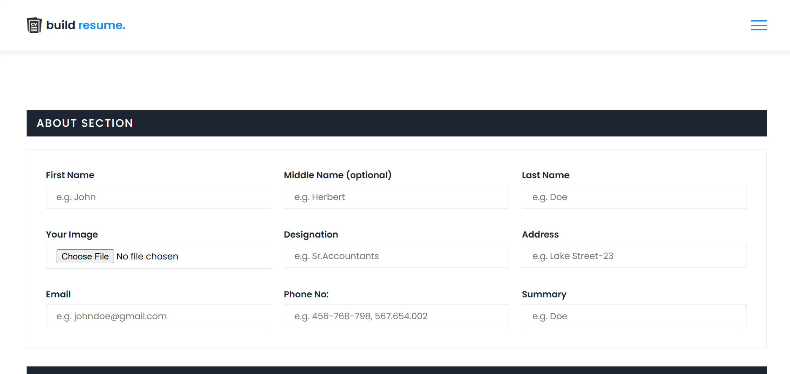

# 💼 AI Resume Builder

A sleek, modern, and fully responsive **AI-powered Resume Builder** using HTML, CSS, and JavaScript. It allows users to generate, edit, and download professional resumes directly in the browser. Includes dark mode, local storage, and optional ChatGPT API integration.

---

## 🚀 Features

- 🧠 **AI Autofill (Optional)** – Use OpenAI’s API to generate resume content.
- 🎨 **Modern UI** – Clean and responsive design with Dark Mode toggle.
- 💾 **Local Storage** – Automatically saves your input.
- 📄 **Download Resume** – Export as a PDF directly from the browser.
- 👀 **Live Preview** – Instant feedback on what your resume will look like.
- 🔁 **One-Click Reset** – Clear all fields and start fresh.

---

## 📸 Demo

🔗 [**Live Demo**](https://Abbas-Devloper.github.io/Ai-Resume-Builder)

---

## 🛠️ Built With

- ✅ **HTML5**
- ✅ **CSS3** (including optional `dark.css`)
- ✅ **Vanilla JavaScript**

